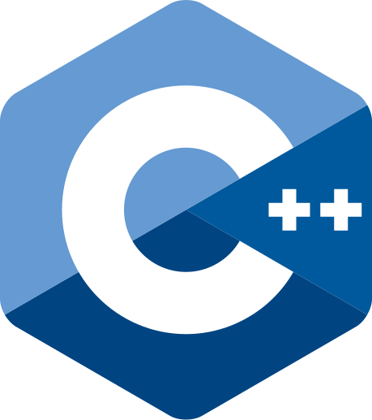
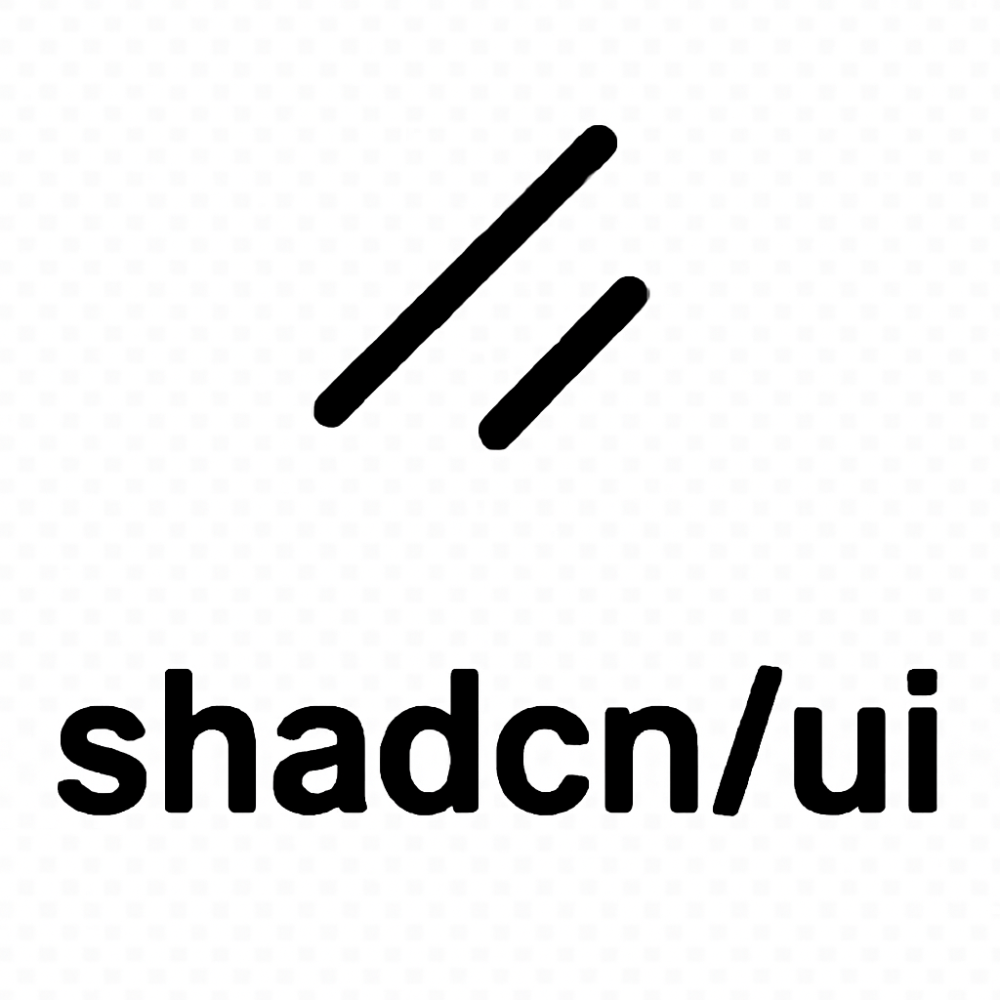
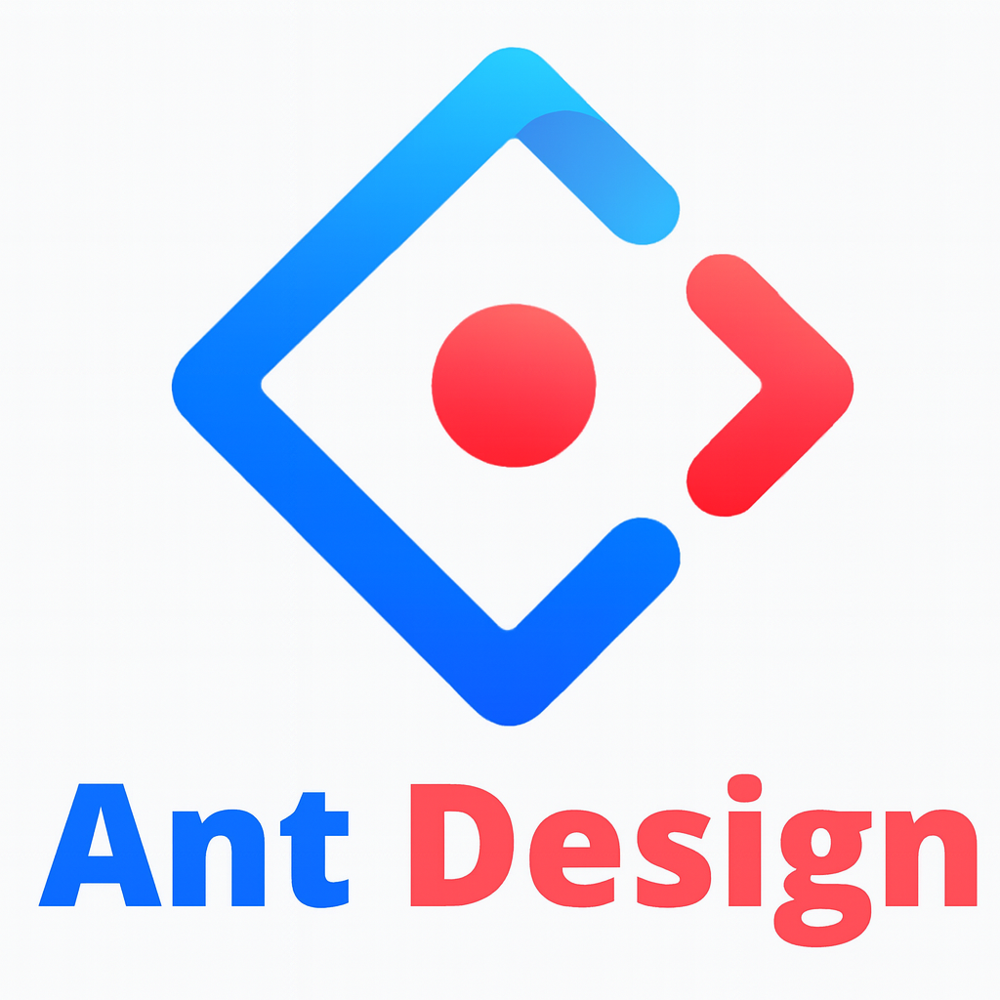
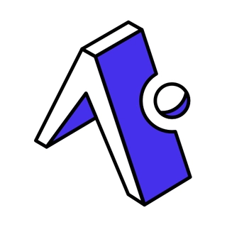
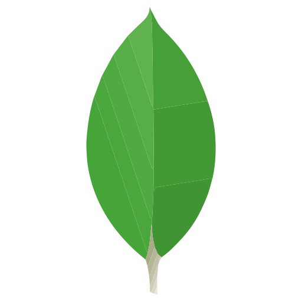
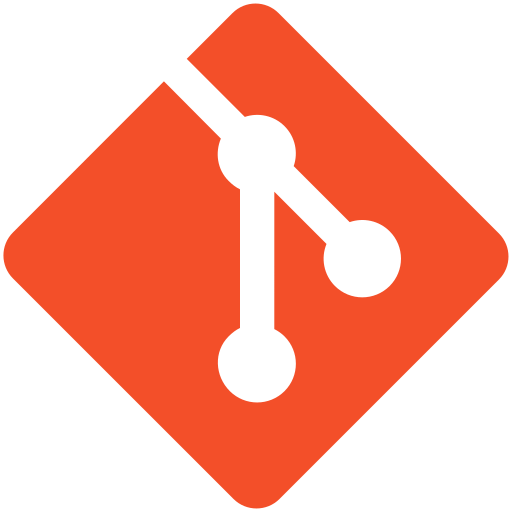

  

###

<h1 align="left">Hi there! Good to see you.</h1>

###

I'm Sakib, <strong>front-end web develoer</strong> from Bangladesh. Currently living <strong>Dhaka.</strong>

###

✨ Working with web development since 2022. 📚 I have completed MERN stack development. 🎯 Goals: Become a full-stack web developer.

###

<h2 align="left">About me</h2>

###

I’m a passionate MERN Stack Developer with hands-on experience in MongoDB, Express, React, and Node.js, along with professional exposure to React Native for building cross-platform mobile applications. With over 2 years of experience, I enjoy developing scalable, efficient, and user-centric solutions by blending strong front-end craftsmanship with reliable back-end logic. Currently, I work as a <strong>Software Developer</strong> at <a href='https://edutechs.app' target="_blank">Edutechs</a>, where I build and maintain production-ready web and mobile applications.

As a computer science<strong>&#40;CSE&#41;</strong> graduate and an active competitive programmer, I have built a strong foundation in programming fundamentals, problem-solving, and algorithmic thinking. This background enables me to write clean, efficient, and scalable code that performs well in real-world production environments.

I have a strong command of React and modern JavaScript, and I specialize in building full-stack applications that are not only visually appealing but also performance-optimized. I enjoy crafting intuitive user interfaces and seamlessly connecting them with robust back-end services using technologies like Firebase and Supabase, ensuring smooth and reliable user experiences across web and mobile platforms.

Creating state-of-the-art, intuitive, and user-friendly applications is not just my profession—it’s my passion. I am confident that my technical skills, dedication, and continuous learning mindset make me a valuable asset to any development team. I actively stay updated with emerging technologies and industry trends to consistently deliver innovative and high-quality solutions.

Looking ahead, my goal is to grow into a skilled software engineer by deepening my knowledge of algorithms, system design, and best coding practices. I aspire to work on impactful projects, contribute to open-source communities, and continuously challenge myself by solving complex problems and embracing new technologies.

Email: sakib.cse.333@gmail.com  
WhatsApp: +8801955-207333

###

<h2 align="left">My skills</h2>

###

<table>
  <!-- Row 1 -->
  <tr>
    <td>
      
    </td>
    <td>
      
    </td>
    <td>
      
    </td>
    <td>
      
    </td>
    <td>
      
    </td>
  </tr>

  <!-- Row 2 -->
  <tr>
    <td>
      
    </td>
    <td>
      
    </td>
    <td>
      
    </td>
    <td>
      
    </td>
    <td>
      
    </td>
  </tr>

  <!-- Row 3 -->
  <tr>
    <td>
      
    </td>
    <td>
      
    </td>
    <td>
      
    </td>
    <td>
      
    </td>
    <td>
      
    </td>
  </tr>

  <!-- Row 4 -->
  <tr>
    <td>
      
    </td>
    <td>
      
    </td>
    <td>
      
    </td>
    <td>
      
    </td>
    <td>
      
    </td>
  </tr>

  <!-- Row 5 -->
  <tr>
    <td>
      
    </td>
  </tr>
</table>

###

<h2 align="left">Social media</h2>

###

  <table style="border-collapse: separate; border-spacing: 12px;">
    <tr>
      <td align="center"
          style="background: #e8f0fe; border-radius: 12px; padding: 12px; padding-bottom: 4px">
        
      </td>
      <td align="center"
        style="background: #e6f7ef; border-radius: 12px; padding: 12px; padding-bottom: 4px">
        
      </td>
      <td align="center"
        style="background: #f5f5f5; border-radius: 12px; padding: 12px; padding-bottom: 4px">
        
      </td>
      <td align="center"
        style="background: #e6f7ef; border-radius: 12px; padding: 12px; padding-bottom: 4px">
        
      </td>
      <td align="center"
          style="background: #e7f3ff; border-radius: 12px; padding: 12px; padding-bottom: 4px">
        
      </td>
    </tr>
  </table>

###

<h2 align="left">My Stats:</h2>

  

###

<h2 align="left">Most Used Languages:</h2>

  

###

<h2 align="left">GitHub Streak:</h2>

  

