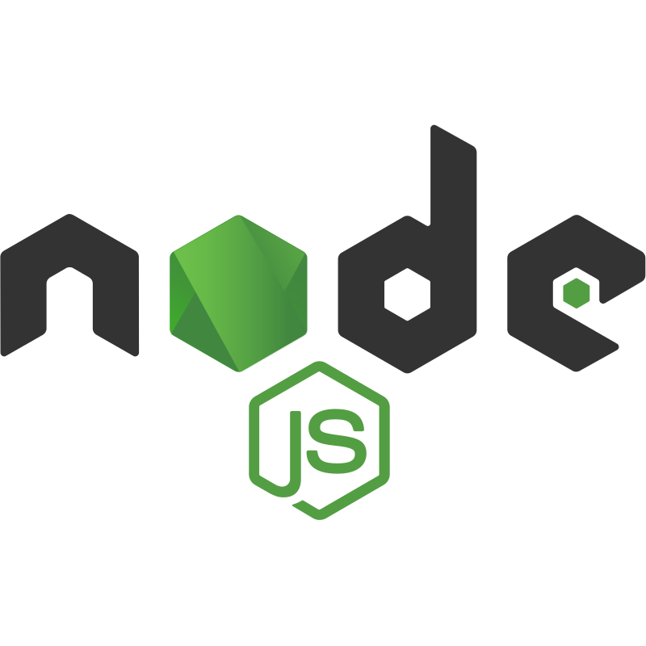
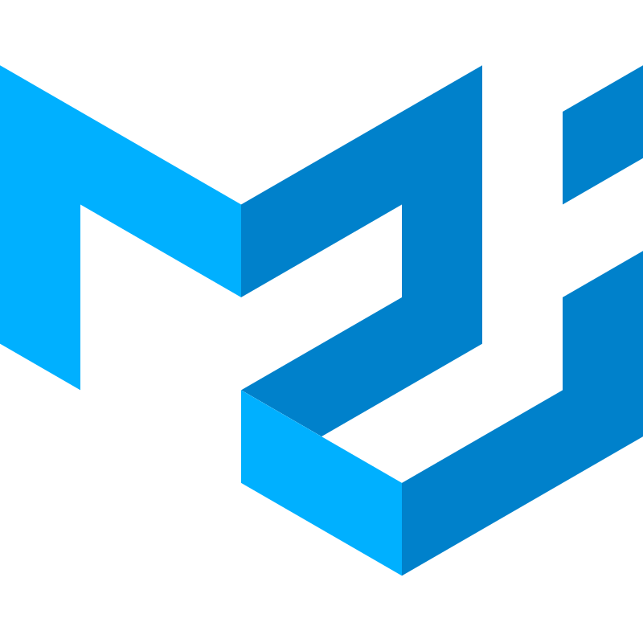

  

###

<h1 align="left">Hi there! Good to see you.</h1>

###

I'm Sakib, <strong>front-end web develoer</strong> from Bangladesh. Currently living <strong>Dhaka.</strong>

###

✨ Working with web development since 2022. 📚 I have completed MERN stack development. 🎯 Goals: Become a full-stack web developer.

###

<h2 align="left">About me</h2>

###

I’m a passionate MERN Stack Developer with hands-on experience in MongoDB, Express, React, and Node.js, along with professional exposure to React Native for building cross-platform mobile applications. With over 2 years of experience, I enjoy developing scalable, efficient, and user-centric solutions by blending strong front-end craftsmanship with reliable back-end logic. Currently, I work as a <strong>Software Developer</strong> at <a href='https://edutechs.app'>Edutechs</a>, where I build and maintain production-ready web and mobile applications.

As a computer science<strong>&#40;CSE&#41;</strong> graduate and an active competitive programmer, I have built a strong foundation in programming fundamentals, problem-solving, and algorithmic thinking. This background enables me to write clean, efficient, and scalable code that performs well in real-world production environments.

I have a strong command of React and modern JavaScript, and I specialize in building full-stack applications that are not only visually appealing but also performance-optimized. I enjoy crafting intuitive user interfaces and seamlessly connecting them with robust back-end services using technologies like Firebase and Supabase, ensuring smooth and reliable user experiences across web and mobile platforms.

Creating state-of-the-art, intuitive, and user-friendly applications is not just my profession—it’s my passion. I am confident that my technical skills, dedication, and continuous learning mindset make me a valuable asset to any development team. I actively stay updated with emerging technologies and industry trends to consistently deliver innovative and high-quality solutions.

Looking ahead, my goal is to grow into a skilled software engineer by deepening my knowledge of algorithms, system design, and best coding practices. I aspire to work on impactful projects, contribute to open-source communities, and continuously challenge myself by solving complex problems and embracing new technologies.

Email: sakib.cse.333@gmail.com  
WhatsApp: +8801955-207333

###

<h2 align="left">I code with</h2>

###

  
  
  
  

   
  
  
  
  
   
  
  
  

###

<h2 align="left">Social media</h2>

###

###

<h2 align="left">My Stats:</h2>

  

###

<h2 align="left">Most Used Languages:</h2>

  

###

<h2 align="left">GitHub Streak:</h2>

  

