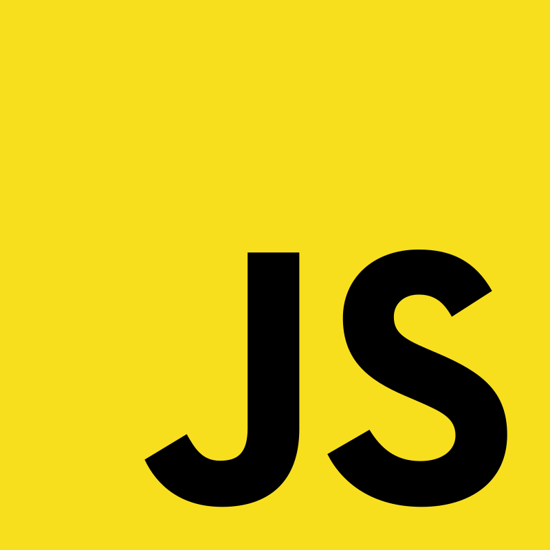

<h1 align="center">Hi 👋, I'm Sakibur Rahman</h1>
<h3 align="center">A passionate frontend developer from Bangladesh</h3>

  

- 📫 Email: **sakib.cse.333@gmail.com**
- 📞 WhatsApp: **+8801955-207333**

<h3 align="left">Connect with me:</h3>

<h3 align="left">Languages and Tools:</h3>

 <a href="https://developer.mozilla.org/en-US/docs/Web/HTML" target="_blank" rel="noreferrer">   </a>  <a href="https://developer.mozilla.org/en-US/docs/Web/JavaScript" target="_blank" rel="noreferrer">   </a>    

