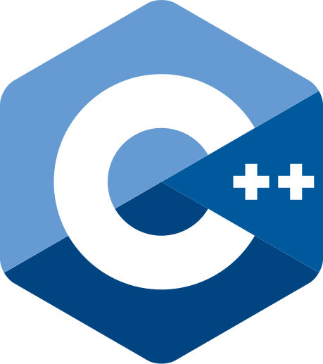
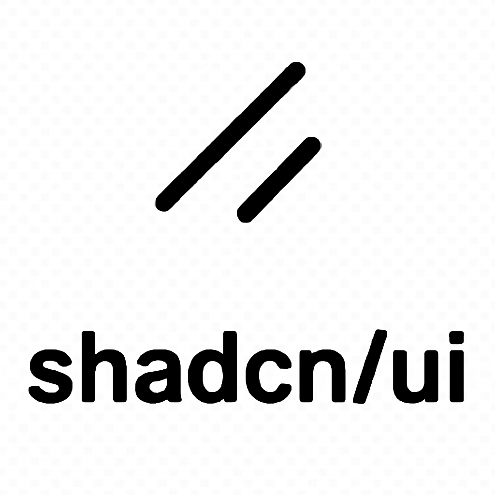
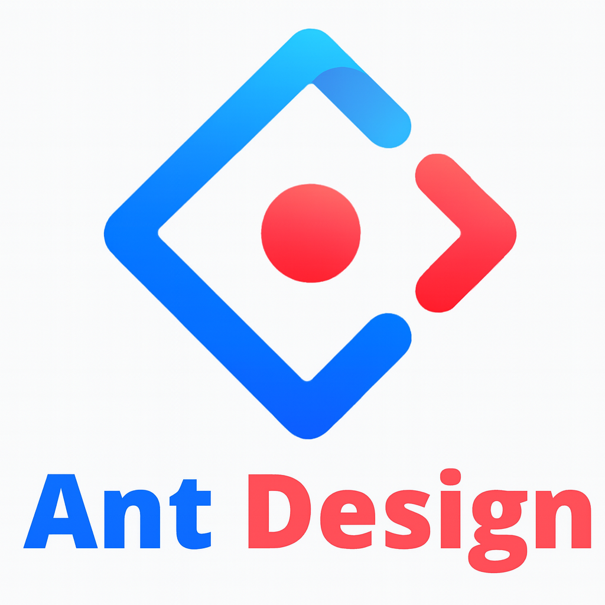
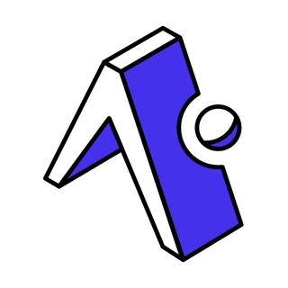
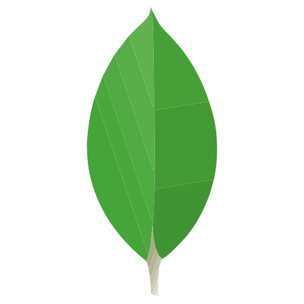
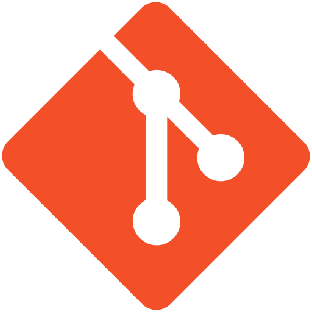

  

###

<h1 align="left">Hi there! Good to see you.</h1>

###

I'm Sakib, <strong>front-end web develoer</strong> from Bangladesh. Currently living <strong>Dhaka.</strong>

###

✨ Working with web development since 2022. 📚 I have completed MERN stack development. 🎯 Goals: Become a full-stack web developer.

###

<h2 align="left">About me</h2>

###

I’m a passionate <strong>Full Stack JavaScript Developer</strong> with hands-on experience in MongoDB, Express.js, React, Node.js, and TypeScript, along with professional experience in React Native for building cross-platform mobile applications. With over <strong>2 years of development experience</strong>, I enjoy creating scalable, efficient, and user-centric software by combining modern front-end technologies with reliable back-end architectures. Currently, I work as a <strong>Junior Software Developer</strong> at <a href="https://edutechs.app" target="_blank">Edutechs</a>, where I develop and maintain production-ready web and mobile applications.

As a Computer Science <strong>&#40;CSE&#41;</strong> graduate and an active competitive programmer, I have built a strong foundation in programming fundamentals, data structures, algorithms, and problem-solving. This background enables me to write clean, maintainable, and efficient code while delivering scalable solutions for real-world applications.

I have strong expertise in React and the modern JavaScript ecosystem, including TypeScript, Tailwind CSS, TanStack Router, Zustand, Firebase, and Supabase. I specialize in building responsive, performance-optimized, and accessible full-stack applications with intuitive user interfaces backed by secure and scalable APIs. Whether developing web or mobile applications, I focus on delivering seamless user experiences and writing high-quality, maintainable code.

I enjoy learning new technologies and continuously improving my development workflow by following modern best practices, writing reusable components, and building applications that are both functional and visually appealing. I believe that continuous learning, attention to detail, and a collaborative mindset are essential qualities for delivering high-quality software.

Looking ahead, my goal is to become a highly skilled software engineer by expanding my expertise in system design, software architecture, cloud technologies, and scalable application development. I aspire to contribute to impactful products, participate in open-source projects, and continuously solve challenging real-world problems through technology.

Email: sakib.cse.333@gmail.com  
WhatsApp: +8801955-207333

###

<h2 align="left">My skills</h2>

###

<table>
  <!-- Row 1 -->
  <tr>
    <td>
      
    </td>
    <td>
      
    </td>
    <td>
      
    </td>
    <td>
      
    </td>
    <td>
      
    </td>
  </tr>

  <!-- Row 2 -->
  <tr>
    <td>
      
    </td>
    <td>
      
    </td>
    <td>
      
    </td>
    <td>
      
    </td>
    <td>
      
    </td>
  </tr>

  <!-- Row 3 -->
  <tr>
    <td>
      
    </td>
    <td>
      
    </td>
    <td>
      
    </td>
    <td>
      
    </td>
    <td>
      
    </td>
  </tr>

  <!-- Row 4 -->
  <tr>
    <td>
      
    </td>
    <td>
      
    </td>
    <td>
      
    </td>
    <td>
      
    </td>
    <td>
      
    </td>
  </tr>

  <!-- Row 5 -->
  <tr>
    <td>
      
    </td>
  </tr>
</table>

###

<h2 align="left">Social media</h2>

###

  <table style="border-collapse: separate; border-spacing: 12px;">
    <tr>
      <td align="center"
          style="background: #e8f0fe; border-radius: 12px; padding: 12px; padding-bottom: 4px">
        
      </td>
      <td align="center"
        style="background: #e6f7ef; border-radius: 12px; padding: 12px; padding-bottom: 4px">
        
      </td>
      <td align="center"
        style="background: #f5f5f5; border-radius: 12px; padding: 12px; padding-bottom: 4px">
        
      </td>
      <td align="center"
        style="background: #e6f7ef; border-radius: 12px; padding: 12px; padding-bottom: 4px">
        
      </td>
      <td align="center"
          style="background: #e7f3ff; border-radius: 12px; padding: 12px; padding-bottom: 4px">
        
      </td>
    </tr>
  </table>

###

<h2 align="left">My Stats:</h2>

  

###

<h2 align="left">Most Used Languages:</h2>

  

###

<h2 align="left">GitHub Streak:</h2>

  

